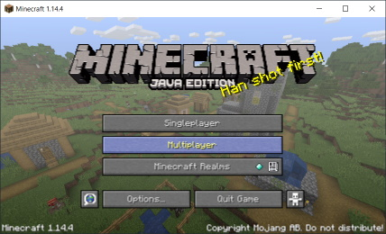
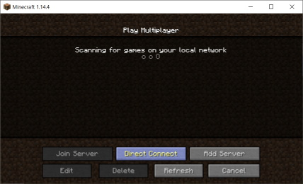
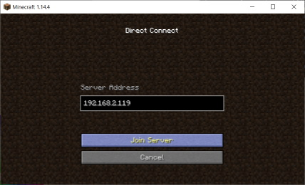
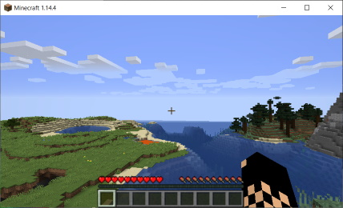

# hello.minecraft

Setting a [Minecraft](https://www.minecraft.net) Server using [Docker](https://www.docker.com/).

## Usage

```console
docker-compose up -d
```

Then fire up your Minecraft Java edition, connect to your server (here: `192.168.2.119`) and enjoy

 
 

## References

- [itzg/minecraft-server/](https://hub.docker.com/r/itzg/minecraft-server/)
- [rlenferink/minecraft](https://hub.docker.com/r/rlenferink/minecraft)
- [Kitematic tutorial: Set up a Minecraft server](https://docs.docker.com/kitematic/minecraft-server/)
- [How to Set Up a Minecraft Server on Ubuntu or Debian](https://www.linode.com/docs/game-servers/how-to-set-up-minecraft-server-on-ubuntu-or-debian/)
